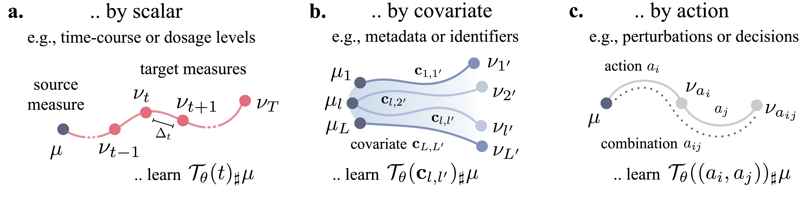

# [Supervised Training of Conditional Monge Maps](https://openreview.net/pdf?id=sPNtVVUq7wi)

<p align='center'> </p>

Optimal transport (OT) theory describes general principles to define and select, among many possible choices, the most efficient way to map a probability measure onto another. That theory has been mostly used to estimate, given a pair of source and target probability measures $(\mu, \nu)$, a parameterized map $T_\theta$ that can efficiently map $\mu$ onto $\nu$. In many applications, such as predicting cell responses to treatments, pairs of input/output data measures $(\mu, \nu)$ that define optimal transport problems do not arise in isolation but are associated with a context $c$, as for instance a treatment when comparing populations of untreated and treated cells. To account for that context in OT estimation, we introduce `CondOT`, a multi-task approach to estimate a family of OT maps conditioned on a context variable, using several pairs of measures $(\mu_i, \nu_i)$ tagged with a context label $c_i$. `CondOT` learns a global map $T_\theta$ conditioned on context that is not only expected to fit all labeled pairs in the dataset ${(c_i,(\mu_i, \nu_i))}$, i.e., $T_\theta(c_i) \sharp \mu_i \approx \nu_i$, but should also generalize to produce meaningful maps $T_\theta(c_{new})$ when conditioned on unseen contexts $c_{new}$. Our approach harnesses and provides novel usage for partially input convex neural networks, for which we introduce a robust and efficient initialization strategy inspired by Gaussian approximations. We demonstrate the ability of `CondOT` to infer the effect of an arbitrary combination of genetic or therapeutic perturbations on single cells, using only observations of the effects of said perturbations separately.

## Quest setup

Location of repo on quest:
```
/projects/b1196/ewa_group/condot/`
```

Prepare environment:

```
eval "$(/software/mamba/23.1.0/bin/conda shell.bash hook)"
CONDA_OVERRIDE_CUDA="11.2" mamba create --prefix=/projects/b1196/envs/condot -c conda-forge gxx_linux-64 gcc_linux-64 python=3.9.7 cudatoolkit=11.2
conda activate /projects/b1196/envs/condot
pip install pip-tools
```

Install condot:

```
cd /projects/b1196/ewa_group/condot/
pip-compile requirements.in
pip-sync
python setup.py develop
```

Every new dependency should be added first to `requirements.in`, then:
```
pip-compile requirements.in
pip-sync
python setup.py develop
```
It will take a while to resolve the dependencies. No `pip install` for the sake of sanity :( 

```
screen -S condot
# Run GPU here
conda activate /projects/b1196/envs/condot
cd /projects/b1196/ewa_group/condot/
```

## Installation

To install all dependencies, execute the following steps:
```
conda create --name cell python=3.9.7
conda activate cell

conda update -n base -c defaults conda

pip install -r requirements.txt
python setup.py develop
```
In case you do not use miniconda, make sure to use the right versions of the libraries
specified in the `requirements` file.

If you want jupyter notebook support (may have errors), run the following
commands (inside `cell`):
```
conda install -c anaconda ipykernel
python -m ipykernel install --user --name=cell
```
Change the kernel name to `cell` or create a new iPython notebook using `cell`
as the kernel.

## Run Experiments

To run an experiment, execute the `scripts/train.py` with the particular configuration of interest. Let's look at one example:

```
python scripts/train.py \
    --outdir ./results/models-pca-50d/scrna-sciplex3/drug-trametinib/emb-val/holdout-10/model-condot \
    --config ./configs/condot.yaml \
    --config ./configs/tasks/sciplex3-top1k.yaml \
    --config ./configs/experiments/val.yaml \
    --config ./configs/projections/pca.yaml \
    --config.data.property dose \
    --config.data.target trametinib \
    --config.datasplit.holdout.dose 100
```

This executes the `CondOT` model (see `configs/condot.yaml`) on the Sciplex3 dataset (see `configs/tasks/sciplex3-top1k.yaml`). Here, we aim at conditioning on the scalar `dose`, which is a property of the Sciplex3 dataset, and thus choose a scalar embedding (see `configs/experiments/val.yaml`). In the example, we use PCA as a low dimensional representation (see `configs/projections/pca.yaml`), and run experiments for a selected drug, i.e., we update the config with `--config.data.target trametinib`.
Lastly, if we want to specify a **holdout** value, we need to specify this in the config via `--config.datasplit.holdout. ...`.

There are multiple datasets, see different config files in the `configs/tasks` folder. Multiple embedding types are available, i.e., `val` for scalars, `ohe` for features and actions, `moa` for mode-of-action embeddings (see also `notebooks/eval/mds_perturbations.ipynb` for details).

If you would like to condition on the cell line of Sciplex3, for example, set `config.data.property` to `cell_type` instead of `dose`. Also use `configs/experiments/ohe.yaml` instead of `configs/experiments/val.yaml`. For different choices of drugs, change `config.data.target`. In the paper we considered Givinostat and Trametinib.

```
python scripts/train.py \
    --outdir ./results/models-pca-50d/scrna-sciplex3/drug-givinostat/emb-ohe/holdout-K562/model-condot \
    --config ./configs/condot.yaml \
    --config ./configs/tasks/sciplex3-top1k.yaml \
    --config ./configs/experiments/ohe.yaml \
    --config ./configs/projections/pca.yaml \
    --config.data.property cell_type \
    --config.data.target givinostat \
    --config.datasplit.holdout.cell_type K562
```

If you consider an autoencoder embedding rather than PCA, you need to train the corresponding autoencoder first (see the corresponding config `configs/autoencoder.yaml`). When considering a holdout value, e.g., all but one dosage, make sure to train it on all but the holdout dosage with a similar strategy as described above.

```
python scripts/train.py \
    --outdir ./results/models-ae-50d/scrna-sciplex3/drug-trametinib/emb-ohe/holdout-K562/model-autoencoder \
    --config ./configs/autoencoder.yaml \
    --config ./configs/tasks/sciplex3-top1k.yaml \
    --config ./configs/experiments/ohe.yaml \
    --config.data.property cell_type \
    --config.data.target trametinib \
    --config.datasplit.holdout.cell_type K562
```

To consider different dataset splits, e.g., splits into seen and unseen perturbations, add `--split` to the training call, followed by the name of the split in your dataset.
For this experiment, we do not consider conditioning on properties, but instead the targets / perturbation themselves. For the Norman et al. dataset, `config.data.condition` is already pre-specified in the `configs/tasks/norman.yaml`.
An exemplary function call thus could be
```
python scripts/train.py \
    --outdir ./results/models-pca-50d/scrna-norman/emb-ohe/split-1/model-condot \
    --config ./configs/condot.yaml \
    --config ./configs/tasks/norman.yaml \
    --config ./configs/experiments/ohe.yaml \
    --config ./configs/projections/pca.yaml \
    --split ./datasets/scrna-norman/split-1.csv 
```

For evaluation, please see [http://github.com/bunnech/cellot](http://github.com/bunnech/cellot).

## Data Availability

Preprocessed datasets and splits of Srivatsan et al. (2020) and Norman et al. (2019) are provided [here](https://github.com/facebookresearch/CPA).

## Citation

In case you found our work useful, please cite us:
```
@inproceedings{bunne2022supervised,
  title={{Supervised Training of Conditional Monge Maps}},
  author={Bunne, Charlotte and Krause, Andreas and Cuturi, Marco},
  booktitle={Advances in Neural Information Processing Systems (NeurIPS)},
  year={2022},
}
```

## Contact
In case you have questions, reach out to `bunnec@ethz.ch`.
